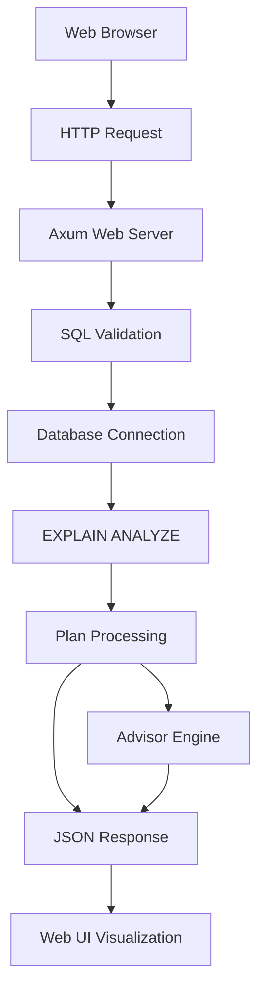

# SQLTrace Architecture

## Overview

SQLTrace is designed as a modular, extensible web-based SQL query analyzer with the following primary goals:

1. **Performance**: Fast and responsive even with large execution plans
2. **Multi-Engine Support**: Support for PostgreSQL, MySQL, and SQLite databases
3. **Usability**: Intuitive web interface for exploring and understanding query execution
4. **Actionable Insights**: Provide meaningful optimization suggestions and benchmarking

## High-Level Architecture

## Core Components

### 1. Web Interface

- **Responsibility**: Handle command-line arguments and user input
- **Key Features**:
  - Connection string parsing
  - Query input handling
  - Output format configuration
  - Interactive vs non-interactive modes

### 2. Database Adapters

- **Responsibility**: Abstract database-specific operations
- **Key Features**:
  - Connection management
  - Query execution
  - Plan retrieval (EXPLAIN ANALYZE)
  - Database metadata access

### 3. Plan Processors

- **Responsibility**: Normalize execution plans from different databases
- **Key Features**:
  - Parse database-specific plan formats
  - Convert to common intermediate representation
  - Calculate derived metrics

### 4. Visualization Engine

- **Responsibility**: Render execution plans in the web interface
- **Key Features**:
  - Tree-based plan visualization
  - Color-coded performance indicators
  - Interactive navigation
  - Multiple view modes (tree, flamegraph, etc.)

### 5. Advisor Engine

- **Responsibility**: Analyze plans and suggest optimizations
- **Key Features**:
  - Rule-based analysis
  - Performance bottleneck detection
  - Index suggestion
  - Query rewriting recommendations

### 6. Web Renderer

- **Responsibility**: Handle web UI rendering and interaction
- **Key Features**:
  - Responsive layout
  - Keyboard navigation
  - View management
  - Help system

## Data Flow

1. **Initialization**:
   - Parse web arguments
   - Initialize database connection
   - Set up web interface

2. **Query Execution**:
   - User submits query
   - Query is sent to database with EXPLAIN ANALYZE
   - Raw plan is returned

3. **Plan Processing**:
   - Parse raw plan into common format
   - Calculate derived metrics
   - Generate optimization suggestions

4. **Rendering**:
   - Update web interface with plan visualization
   - Display performance metrics
   - Show optimization suggestions

## Error Handling

- **Database Errors**: Connection issues, query syntax errors
- **Plan Parsing**: Malformed plan output
- **Web Renderer**: Terminal compatibility issues
- **Validation**: Invalid configuration or input

## Performance Considerations

- **Plan Size**: Handle large execution plans efficiently
- **Rendering**: Optimize for slow network connections
- **Memory**: Manage memory usage for large result sets
- **Responsiveness**: Keep UI responsive during processing

## Security Considerations

- **Credentials**: Secure handling of database credentials
- **Query Safety**: Prevent accidental data modification
- **Output**: Sanitize any sensitive data in logs/export

## Future Extensibility

- **Plugins**: Support for custom visualizations and analyzers
- **Export Formats**: Additional output formats (JSON, HTML, PNG)
- **Database Support**: Easy addition of new database backends
- **CI Integration**: Automated query analysis in CI/CD pipelines
