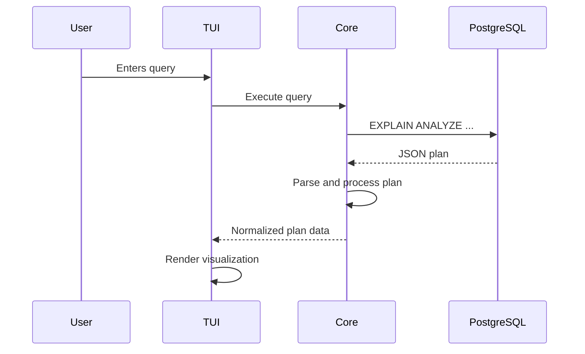

# RFC 0001: PostgreSQL MVP Implementation

- **Author(s):** Lokesh Kumar
- **Status:** Draft
- **Created:** 2025-07-20
- **Updated:** 2025-07-20

## Summary

This RFC proposes the implementation of the Minimum Viable Product (MVP) for SQLTrace with PostgreSQL support, including basic TUI visualization of execution plans.

## Motivation

To provide developers with a powerful, terminal-based tool for analyzing PostgreSQL query execution plans, helping them understand and optimize their database queries.

## Guide-level explanation

Users will be able to:

1. Connect to a PostgreSQL database
2. Enter SQL queries
3. View execution plans in an interactive TUI
4. See basic performance metrics and optimization hints

## Reference-level explanation

### Core Components

1. **PostgreSQL Adapter**
   - Uses `sqlx` for database connectivity
   - Implements `EXPLAIN (ANALYZE, BUFFERS, FORMAT JSON)` for plan retrieval
   - Handles connection pooling and timeouts

2. **Plan Parser**
   - Parses PostgreSQL's JSON execution plan format
   - Normalizes to a common internal representation
   - Calculates derived metrics (cost, actual time, rows)

3. **TUI Components**
   - Plan tree visualization
   - Performance metrics panel
   - Query input area
   - Status bar with connection info

### Data Flow

### Error Handling

- Database connection failures
- Invalid SQL queries
- Permission issues
- Timeout handling

## Drawbacks

- Initial implementation limited to PostgreSQL
- Basic visualization may not cover all plan details
- Limited optimization suggestions in MVP

## Alternatives Considered

1. **Using existing libraries**
   - Considered using `pg_plan_advsr` but decided against due to PostgreSQL version dependencies

2. **Web-based UI**
   - Considered but rejected to maintain focus on terminal usage

## Unresolved Questions

- Should we support saving/loading query history?
- What's the best way to handle very large execution plans?

## Future Possibilities

- Add more detailed optimization suggestions
- Support for query history and comparison
- Additional visualization formats (flamegraphs, etc.)
- Integration with CI/CD pipelines
